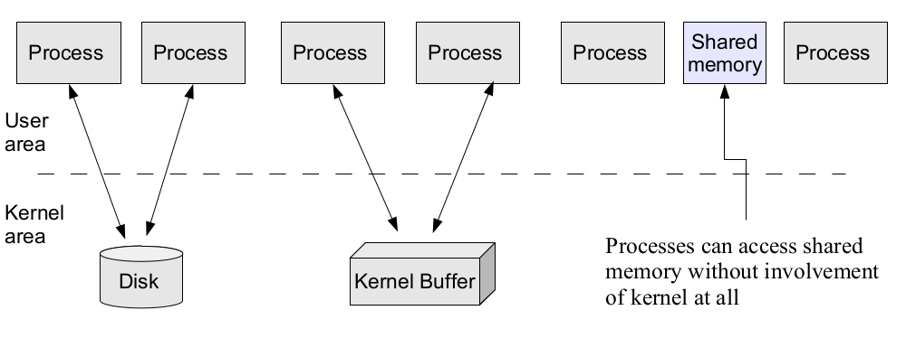
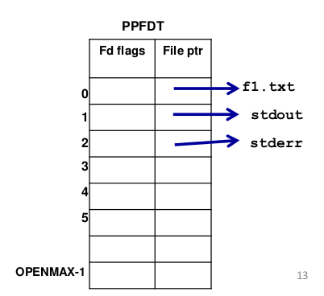
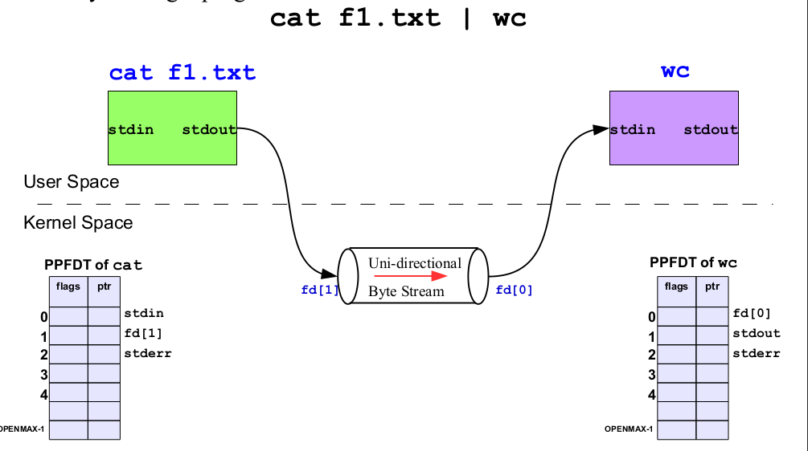
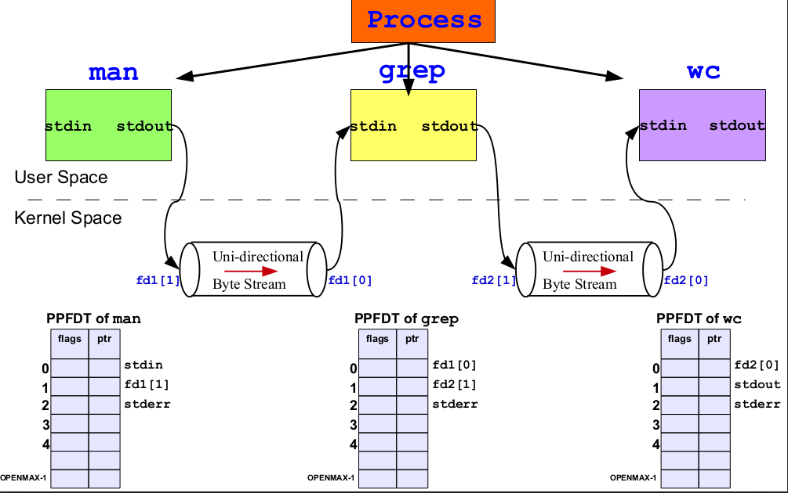
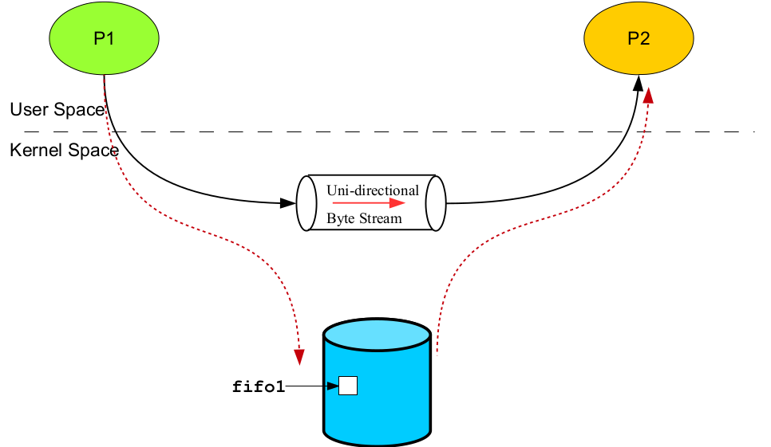

# Inter Process Communication

# IO Redirection and IPC(InterProcess communication)

I/O redirection is a technique used to control where the input and output of a command or program are directed. It allows you to change where standard input (stdin), standard output (stdout), and standard error (stderr) are sent. This is achieved using special symbols and operators in the command line.

IPC refers to mechanisms and techniques that processes use to communicate and share data with each other in a multi-process or multi-threaded environment. Linux provides several IPC mechanisms for processes to exchange data and synchronize their activities.

### Ways of infomation sharing

---

- **Process-to-process** communication using disk is a method of sharing information between two or more processes by using **files** **stored** on a **disk** or **file** **system**. This approach involves writing data to a file that is accessible by **multiple** processes. Each process can read from or write to this file to **exchange** information.

- **Kernel buffers** can be used to facilitate process-to-process communication in a more efficient and controlled manner compared to disk-based communication. Kernel buffers provide **shared memory** regions that are **managed** by the **operating** system, allowing processes to **exchange** data without the overhead of disk I/O.

- **Process-to-process communication using shared memory** involves sharing a region of **memory** between **multiple** **processes**. This allows processes to exchange data **efficiently** without the need for disk I/O or **kernel** intervention.



### File Management in Linux

---

- **fd** = `open(pathname, flags, mode)` opens the file identified by
pathname, returning a file descriptor used to refer to the open file in
subsequent calls. If the file doesn’t exist, open() may create it,
depending on the settings of the flags bit. The flags argument also
specifies whether the file is to be opened for reading, writing, or
both. The mode argument specifies the permissions to be placed on
the file if it is created by this call. If the open() call is not being used
to create a file, this argument is ignored and can be omitted
- **numread** = `read(fd, buffer, count)` reads at most count bytes from
the open file referred to by fd and stores them in buffer. The read()
call returns the number of bytes actually read. On eof, read() returns 0.
- **numwritten** = `write(fd, buffer, count)` writes up to count bytes from
buffer to the open file referred to by fd. The write() call returns the
number of bytes actually written, which may be less than count
- **status** = `close(fd)` is called after all I/O has been completed, in order
to release the file descriptor fd and its associated kernel resources.

### File descriptor

---

In computing, a file **descriptor** is a unique integer or handle used to identify an open file within a process. File descriptors are an essential concept in Unix-like operating systems, including Linux, as they are used to represent and manage `open files, directories, pipes, sockets, and other I/O resources`.

#### Standard Descriptors in UNIX / Linux

---

Three files are automatically opened for every process to
read its input from and to send its output and error
messages to these files are called standard files.

• 0 – `Standard Input (stdin)`. Default input to a
program is from the user terminal (keyboard), if no file
name is given.
• 1 – `Standard Output (stdout)`. A simple program’s
output normally goes to the user terminal (monitor), if
no file name is given.
• 2 – `Standard Error (stderr)`. Default output of error

messages from a program normally goes to the user
terminal, if no file name is given. These numbers are called File Descriptors – System calls
use them to refer to files.

### Redirecting Input of a Command (0<)

---

By default, cat and sort commands takes their input
form the standard input, i.e. key board. We can
detach the key board from stdin and attach some
file to it; i.e. cat command will now read input from
this file and not from the key board

```bash
cat 0 < f1.txt
sort 0 < f1.txt
```



### Redirecting Output of a Command (1>)

---

Similarly, by default cat and sort commands sends
their outputs to user terminal. We can detach the
display screen from stdout and attach a file to it; i.e.
cat command will now write its output to this file and
not to the display screen

```bash
cat 1 > f1.txt
```

- Similarly they have a slight different **PPFDT**

### Redirecting Error of a Command (2>)

---

Similarly, by default all commands send their error
messages on stderr. This is called
error redirection

```bash
cat file.txt 2 > error.txt
```

- Similarly they have a slight different **PPFDT**

### Redirecting Input, Output and Error

---

```bash
cat 0 < f1.txt 1 > f2.txt 2 > f3.txt
```

### Duplicating a File Descriptor

---

```bash
cat 0 < f1.txt 1 > f2.txt 2 > &1
```

## Taxonomy of Inter Process Communication

`Independent process` is a process that cannot
affect or cannot be affected by the execution of
another process. A process that does not share
data with another process is independent.

`Cooperating process` is a process that can affect
or can be affected by the execution of another
process. A process that share data with other
process is a cooperating process.

- Advantages of Cooperating processes
  - Information sharing
  - Computation speed up
  - Modularity
  - Convenience

### UNIX IPC Tool: Pipes

---

Pipes are used for communication between
related processes (parent-child-sibling) on
the same UNIX system.

```bash
// Using pipes to count lines in a file
cat file.txt | wc -l
```

- The **output** of the **cat** program directed towards the **pipe** and **wc** program gets **input** from the pipe.

- Pipes have no names, and their biggest disadvantage is that they can be
only used between processes that have a parent process in common
(ignoring descriptor passing)

### Introduction to pipes

---

#### History of Pipes

Pipes history goes back to 3rd edition of UNIX
in 1973. They have no name and can therefore be used only
between related processes. This was corrected in 1982 with the
addition of FIFOs

#### Byte stream

When we say that a pipe is a byte stream, we mean
that there is no concept of message boundaries when using a pipe.
Each read operation may read an arbitrary number of bytes
regardless of the size of bytes written by the writer. Furthermore,
the data passes through the pipe sequentially, bytes are read from
a pipe in exactly the order they were written. It is not possible to
randomly access the data in a pipe using lseek().

#### Blocking Behavior

- When reading from a pipe, a process will block (wait) if no data is available until data becomes available or the writing end is closed.
- When writing to a pipe, a process will block if the pipe's internal buffer is full, waiting for space to become available.

#### Data Integrity

- Pipes are suitable for transferring structured data or plain text between processes.
- Data integrity is the responsibility of the communicating processes.
- If the write end of a pipe is closed, and a process tries to read, it
will receive and EOF character, i.e., read() returns 0
- If two processes try to read from the same pipe, one process will
get some of the bytes from the pipe, and the other process will get
the other bytes. Unless the two processes use some method to
coordinate their access to the pipe, the data they read are likely to
be incomplete.

#### Size of Pipe

- If multiple processes are writing to a single pipe, then it is
guaranteed that their data won’t be intermingled if they write no
more than PIPE_BUF bytes at a time
- This is because writing PIPE_BUF number of bytes to a pipe is
an atomic operation. On Linux, value of PIPE_BUF is 4096
- When writing more bytes than PIPE_BUF to a pipe, the kernel
may transfer the data in multiple smaller pieces, appending
further data as the reader removes bytes from the pipe. The
write() call blocks until all of the data has been written to the
pipe
- When there is a single writer process, this doesn’t matter. But in
case of multiple writer processes, this may cause problems.

### cat f1.txt | wc

---



### man ls | grep ls | wc -l

---



## FIFO's (Named Pipes)

FIFOs, also known as named pipes, are a form of inter-process communication (IPC) in Unix-like operating systems. A FIFO is a special type of file that acts as a unidirectional communication channel, allowing unrelated processes to exchange data. FIFOs are commonly used when you need to establish communication between processes that are not directly related, unlike parent-child relationships.

- UNIX FIFO is similar to a pipe, as it is a one way (half duplex) flow of
data. But unlike pipes a FIFO has a path name associated with it
allowing unrelated processes to access a single pipe.

- FIFOs/named pipes are used for communication between related or
unrelated processes executing on the same machine.

- A FIFO is created by one process and can be opened by multiple
processes for reading or writing. When processes are reading or writing
data via FIFO, kernel passes all data internally without writing it to the
file system. Thus a FIFO file has no contents on the file system; the
file system entry merely serves as a reference point so that processes
can access the pipe using a name in the file system.



### Introduction to Signals

---

Signal is a software **interrupt** delivered to a process by **OS** because

- **The process did something (SIGFPE (8), SIGSEGV (11), SIGILL (4))**
- **The user did something (SIGINT (2), SIGQUIT (3), SIGTSTP (20))**
- **One process wants to tell another process something (SIGCHILD (17))**

#### Example

- Suppose a program is running in a while(1) loop and you press
Ctrl+C key. The program dies. How does this happens?
  - User presses Ctrl+C
  - The tty driver receives character, which matches intr
  - The tty driver calls signal system
  - The signal system sends SIGINT(2) to the process
  - Process receives SIGINT(2)
  - Process dies

- Signals are usually used by OS to notify processes that some event
has occurred, without these processes needing to poll for the event.
- Whenever a process receives a signal, it is interrupted from whatever it
is doing and forced to execute a piece of code called signal handler.
When the signal handler function returns, the process continues
execution as if this interruption has never occurred.
- A **signal handler** is a function that gets called when a process receives
a signal. Every signal may have a specific handler associated with it. A
signal handler is called in asynchronous mode. Failing to handle
various signals, would likely cause our application to terminate, when it
receives such signals.

## Additional Links

- [Overview of OS](https://github.com/meharehsaan/operating-system/tree/master/overview)
- [Intro to Linux](https://github.com/meharehsaan/operating-system/tree/master/introduction-to-linux)
- [Basic Shell Commands](https://github.com/meharehsaan/operating-system/tree/master/basic-shell-commands)
- [Program-vs-Process](https://github.com/meharehsaan/operating-system/tree/master/program-vs-process)
- [System Calls](https://github.com/meharehsaan/system-programming/tree/master/system-calls)
- [C program compilation](https://github.com/meharehsaan/system-programming/tree/master/c-compilation)
- [Linking C program](https://github.com/meharehsaan/system-programming/tree/master/linking)
- [File System Architecture](https://github.com/meharehsaan/system-programming/tree/master/filesystem-architecture)
- [Pipe's & Fifo's](https://github.com/meharehsaan/system-programming/tree/master/pipes)
- [IPC-Signals](https://github.com/meharehsaan/system-programming/tree/master/IPC-Signals)

<br>

---

Best Regards - [Mehar Ehsaan](github.com/meharehsaan)
