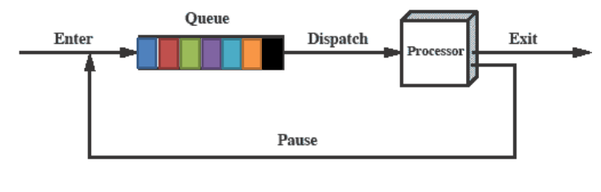
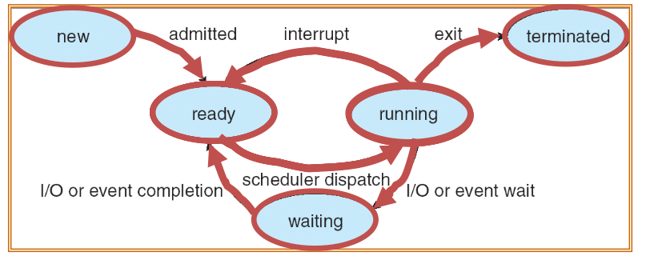
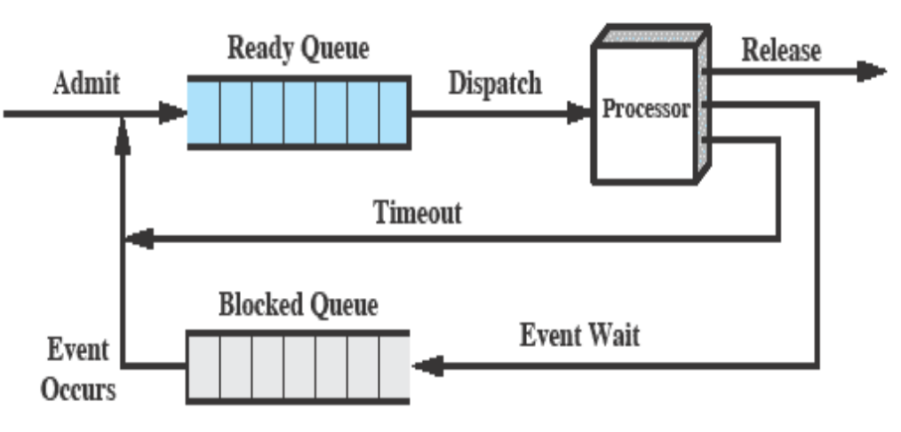
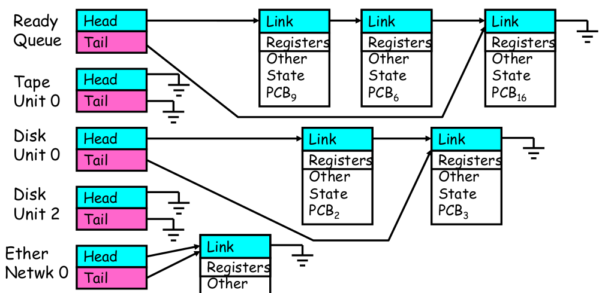
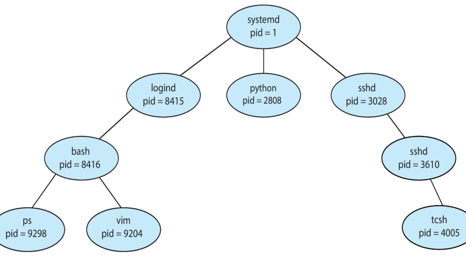
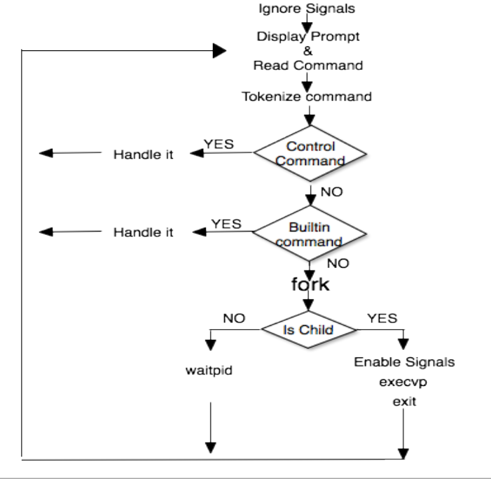

# Process Managment

Process management refers to the activities involved in `managing` the execution of `multiple` processes in an operating system. It includes `creating, scheduling, and terminating processes`, as well as allocating system resources such as CPU time, memory, and I/O devices.

- Youtube Lecture Sir Arif Butt ([Link](https://www.youtube.com/watch?v=2bYGoOTXrUg&list=PL7B2bn3G_wfBuJ_WtHADcXC44piWLRzr8&index=8))

## Contents

- `CPU & I/O` Bound Processes
- Process Related `UNIX` Commands
- 2 **State Process Model**
- 5 **State Process Model**
- 6 **State Process Model**
- 7 **State Process Model**
- `Context` Switch / `Process` Switch
- Process **Creation**
- Processes `Tree` on a UNIX System
- Process **Termination**
- Process **ID** and Parent Process ID
- Process Creation using **fork**()
- **Orphan** Processes
- **Zombie** Processes
- Process `Resource` Limits
- Accessing System **Configurations**
- `Additional Links`

### I/O Bound Processes

---

I/O-bound process – `spends more time doing I/O`
than computations; Many short CPU bursts

- Examples: Word processing, text editors. Billing
system of **Wapda** which involves lot of printing

### CPU Bound Processes

---

CPU-bound process – `spends more time doing`
computations; Few very long CPU bursts

- Examples: Simulation of NW traffic involving lot of
mathematical calculation, scientific applications
involving matrix multiplication, DSP applications.

### Process Related UNIX Commands

---
|Command|Description|
|:-----:|:---------:|
| ps [-aelu] | Display status of processes|
| top | Display information about top 20 processes|
| vim file1.txt & | Running a command in back ground|
| CTRL + Z | Suspend a foreground process to go back to the shell|
| jobs | Display status of suspended and background processes|
| bg %job_id | Put a process in background|
| fg %job_id | Move background process to the foreground|
| CTRL + C | Kill foreground process|
| kill [-signal_no] proc_list | Send the signal for signal_no to processes whose PIDs or jobIDs are specified in proc_list. jobIDs must start with %.|

## 2-State Process Model

- Broadly speaking life of a process consists of CPU
bursts and I/O bursts. So simplest possible model can
be constructed by observing that at any particular
time, a process is either being executed by a processor
or is not running or waiting for an I/O
- There may be a number of processes in the “not
running” state but only one process will be in “running”
state.



#### Limitations

- If all processes in the queue are always ready to execute only then the
above queuing discipline will work
- But it may also be possible that some processes in the queue are ready
to execute, while some are waiting for an I/O operation to complete
- So the scheduler/dispatcher has to scan the list of processes looking
for the process that is not blocked and is there in the queue for the
longest

## 5-State Process Model

Broadly speaking the life of a process consist of CPU burst
and I/O burst but in reality

- A process may be waiting for an event to occur; e.g. a process has
created a child process and is waiting for it to return the result
- A process may be waiting for a resource which is not available at
this time
- Process has gone to sleep for some time



So generally speaking a Process may be in one of the
following five states

- `new` The process is being created (Disk to Memory)
- `ready` The process is in main memory waiting to be assigned to a
processor
- `running` Instructions are being executed
- `waiting` The process is waiting for some event to occur (I/O
completion or reception of a signal)
- `terminated` The process has finished execution

#### Queuing Diagram

---



#### Limitation

When an event occurs the dispatcher would have to cycle through
the entire Blocked Queue to see which process is waiting for that event.
This can cause huge overhead when there may be 100’s or 1000’s of processes

### Process Scheduling Queues

---

- `Job Queue` – When a process enters the system it is put
into a job Queue. This queue consists of all processes in
the system
- `Ready Queue` – This queue consists of processes that are
residing in main memory and are ready and waiting to
execute. It is generally stored as a link list
- `Device Queues` – When the process is allocated the CPU,
it executes for a while and eventually quits as it may need
an I/O. The list of processes waiting for a particular I/O
device is called a device queue. Each device has its own
device queue
- A process in its life time will be migrating from one `Queue` to
another `Queue`

### Ready Queue And Various I/O Device Queues

---

- Process not running PCB is in some scheduler queue
- Separate queue for each device/signal/condition
- Each queue can have a different scheduler policy



### 6-State Process Model (one suspended state)

---


#### Limitation

This only allows processes which are blocked to be swapped out.
What if there is no blocked process but we still need to free up memory?

#### Solution

Add another state Ready Suspended and swap out a process from the
ready state.

### 7-State Process Model (two suspended state)

---


### Context Switch / Process Switch

- When CPU switches to another process, the
system must save the state (context) of the
‘current’ (old) process and load the saved state
for the new process.
- Context-switch time is overhead; the system does
no useful work while switching.
- Scheduler has nothing to do with a process
switch. It is mainly the job of Dispatcher. The
time it takes for a dispatcher to stop one process
and start another is known as dispatch latency.
- Interrupt, Trap and signal triggers a process
switch.

`Steps` involved in a full Process switch are

- Save context of currently running process
(including PC and other registers)
- Move this PCB to an appropriate Queue
- Select another process for execution (Kernel
Schedules)
- Update PCB of selected process
- Update memory management data structures
- Restore the context of the process

### Process Creation

---

- Parent process create children processes, which,
in turn create other processes, forming a tree of
processes
- Process creation and termination are the only
mechanisms used by the UNIX system to
execute external commands
- Once the OS decides to create a process it
proceeds as follows:
- Assigns a unique PID to the new process
- Allocate space
- Initialize the PCB for that process
- Set appropriate linkages
- Create or expand other data structures

### Processes Tree on a UNIX System



#### Resource sharing

- Parent and children share all resources
- Children share a subset of parent’s resources
(UNIX)
- Parent and child share no resources

#### Execution

- Parent and children execute concurrently
(UNIX)
- Parent waits until children terminate

#### Address Space

- Child duplicate of parent process (UNIX)
- Child has a program loaded onto it

#### UNIX examples

- fork() system call creates a new process
- exec() system call used after a fork to replace
the process memory image with a new executable

#### Reasons for Process Creation

- In batch environment a process is created in
response to the submission of a job
- In interactive environment a process is created
when a new user attempts to log on
- OS can create a process to perform a function
on behalf of a user program. (e.g. printing)
- `Spawning` When a process is created by OS at the explicit request of another process.

### Process Termination

---

- A process terminates when it finishes
executing its last statement and requests
the operating system to terminate it using
the exit() system call
- At this point the process returns data to
its parent process
- Process resources are de-allocated by the
OS, to be recycled later

A parent may terminate execution of one of
its children for a variety of reasons such
as

- Task performed by the child is no longer
required
- Child has exceeded allocated resources (main
memory, execution time, etc.)
- Parent needs to create another child but has
reached its maximum children limit
- Parent exits
- OS does not allow child to continue if its
parent terminates
- Cascaded termination

A process may terminate due to following
reasons

- Normal completion
- Memory unavailable
- Protection error
- Mathematical error
- I/O failure
- Cascading termination (by OS)
- Operator intervention

### Process ID and Parent Process ID

---

```C
pid_t getpid();
pid_t getppid();
```

- Each process has a Process ID (PID), a positive integer that
uniquely identifies a process on the system
- Above calls returns PID and PPID of the current process. Never
fails
- On a shell you can get the PID of the shell in the environment
variable in $$ and the parent ID in environment variable PPID
- The parent of any process can be found by looking at the 4th
field of /proc/PID/stat file. Also see the 3rd field which shows
the state of the process (RSDZTX). (See man page of proc for
details)
- The init, now systemd is a user process having a PID of 1. It is
invoked by the kernel at the end of the booting process
- Page daemon now kthreadd is a system process having a PID of 2.
30
It support the paging of virtual memory system

### Process Creation using fork()

```C
pid_t fork();
```

- The fork() system call allows one process, the parent, to create a
new process, the child
- It is a system call which is called once but return twice, once in
the parent and once in the child. To the parent process it returns
PID of child process and to the child process it returns zero
- After the call returns both parent and child processes continues
their execution concurrently from the next line of code
- The child process is a clone of the parent and obtains copies of
the parent’s stack, data, heap,and text segments
- PIDs are allocated sequentially to the new child processes, so
effectively unique (but do wrap up after a very long time)
- On success, the return value to the child process is 0 and the
return value to the parent process is PID of the child.

The child process inherits the following attributes form
the parent

– Environment
– Open File Descriptor table
– Signal handling settings
– Nice value
– Current working directory
– Root directory
– File mode creation mask (umask)

The child process differs from the parent process

– Different PID and PPID
– Return value from fork()
– Child times for CPU usage are reset to zero
– File locks held by parent are not inherited to child
– Set of pending alarms in the parent are cleared in
the child
– Set of pending alarms in the parent are cleared in
the child

### Main uses of fork()

---

1. When a process wants to duplicate itself, so that parent
& child each can execute different sections of code
concurrently. Example: Consider a network server; parent
waits for a service request from a client. When the
request arrives, parent calls fork & let the child handle
the request. Parent goes back to listen for the next
request
2. When a process wants to execute a different program.
This is common for command shells where the child does
an exec() right after it returns from the fork

#### Reasons for Failure

- Maximum number of processes allowed to
execute under one user has exceeded
- Maximum number of processes allowed on the
system has exceeded
- Not enough swap space

### Orphan Processes

- If a parent has terminated before reaping its
child, and the child process is still running, then
that child is called orphan
- In UNIX all orphan processes are adopted by init
or systemd which do the reaping.

### Zombie Processes

- Zombie Process is a process that has terminated but its parent has not collected its exit status and has not reaped it. So a parent must reap its children.
- When a process terminates but still is holding system resources like PCB and various
tables maintained by OS. It is half-alive & half-dead because it is holding resources.
like memory but it is never scheduled on the CPU
- Zombies can't be killed by a signal, not even with the silver bullet (SIGKILL). The only
way to remove them from the system is to kill their parent, at which time they become
orphan and adopted by init or systemd.

### How a Shell executes Commands



### Process Resource Limits

---

- Every process has as set of resource limits that can be
used to restrict the amounts of various systems
resources that the process may consume
- We can set the resource limits of the shell using the
ulimit built-in command. These limits are inherited by
the processes that the shell creates to execute user
commands.

#### Hard and Soft Limits

- A hard limit is the upper limit that the user can never,
ever go beyond. Say you set a hard limit of 255 processes
per user. No one of the users can exceed that limit, ever
- The soft limit, on the other hand, is a “warning” limit. It
tells the user and the system admin that you are close to
reach the danger level, which is the hard limit. Users are
allowed to go over the soft limit, unlike the hard limit
- Regular users can increase their soft limits up to
the current hard limit, but can’t exceed that. They
can decrease their soft limits to zero
- Regular users can also decrease their hard limits to zero,
but they can’t increase them
- The root is, as always, god of the system, and so can do
whatever (s)he likes with both soft and hard limits.

```bash
# To display stack size of a process
$ ulimit –s
$ ulimit –Ss
$ ulimit –Hs
# To display maximum number of open files that a process can open at any instant of time
$ ulimit –n
$ ulimit –Sn
$ ulimit –Hn
```

### Accessing System Configurations

---

``````bash
$ getconf -a
#To query maximum file name support
$ getconf NAME_MAX
#To query maximum number of child processes that may be owned
by a process simultaneously
$ getconf CHILD_MAX
#To query min/max ranges of various data types
$ getconf UCHAR_MAX
$ getconf CHAR_MAX
$ getconf CHAR_MIN
``````

## Additional Links

Some topics related to Operating System

- [Overview of OS](https://github.com/meharehsaan/operating-system/tree/master/overview)
- [Intro to Linux](https://github.com/meharehsaan/operating-system/tree/master/introduction-to-linux)
- [Basic Shell Commands](https://github.com/meharehsaan/operating-system/tree/master/basic-shell-commands)
- [Program-vs-Process](https://github.com/meharehsaan/operating-system/tree/master/program-vs-process)
- [System Calls](https://github.com/meharehsaan/system-programming/tree/master/system-calls)
- [C program compilation](https://github.com/meharehsaan/system-programming/tree/master/c-compilation)
- [Linking C program](https://github.com/meharehsaan/system-programming/tree/master/linking)
- [File System Architecture](https://github.com/meharehsaan/system-programming/tree/master/filesystem-architecture)
- [Pipe's & Fifo's](https://github.com/meharehsaan/system-programming/tree/master/pipes)
- [IPC-Signals](https://github.com/meharehsaan/system-programming/tree/master/IPC-Signals)

<br>

---

Best Regards - [Mehar Ehsaan](github.com/meharehsaan)
