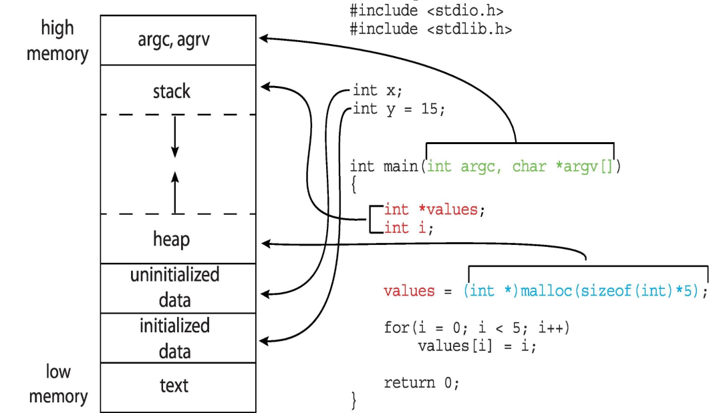
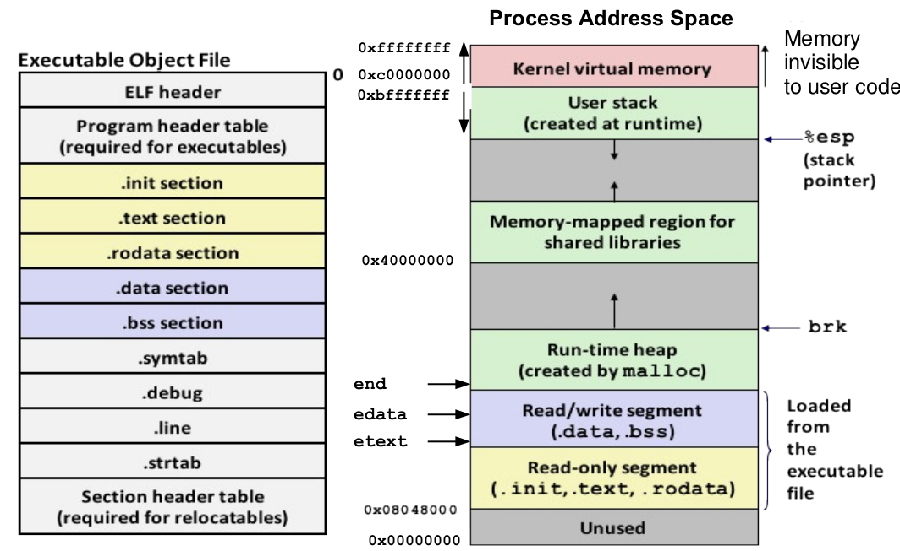

# Program vs Process

A `program` by itself is not a Process, program is a passive entity like the contents of a file stored on a disk.

`Process` is an active entity, in which the Program Counter specifies
the next instruction to be executed
- A process is a program in execution
- An instance of a program running on a computer
- An entity that can be assigned to and executed on a processor

The UNIX system creates a `process` every time you run an `external`
command, and the **process** is removed from the system when the
command `finishes` its **execution**.

So we can get some revision of `C` **compilation** here ([Link](https://github.com/meharehsaan/system-programming/tree/master/c-compilation))



## Program Execution

Execution sequence

- Fetch Instruction at PC
- Decode
- Execute (possibly using registers)
- Write results to registers/mem
- PC = Next Instruction (PC)
- Repeat

### A Program on Disk

---

- A program is a file containing a range of information that
describes how to construct a process, when a program file
is loaded into memory.
- Object file formats vary from system to system, like `a.out`,
`COFF`, `ELF` and `PE`. Today almost all of the `UNICES` use
Executable and Linking Format.
- ELF not only simplifies the task of making shared libraries,
but also enhances dynamic loading of modules at run time.
An executable file using the ELF format consist of ELF
Header, Program Header Table and Section Header Table.

The files that are represented in this format are

- Relocatable file objects `(.o)`
- Normal executable files `(a.out)`
- Shared object files `(.so)`
- Core files

`Program Loading` is a process of copying a program from disk to main memory in order to make it a process.

### Components of a Program

---

1. `.init section` contains different start up routines, which are
executed before calling the main() function
2. `.text section` contains machine code and is read-only
3. `.rodata section` contains read only data like strinng literals and
constants
4. `.data section` contains initialized global and static variables
5. `.bss section` contains uninitialized global variables. Named
after `IBM704` assembly instruction Block Storage Start. Since
this section occupies no actual space in the object file, so some
people call it Better Save Space
6. `.symtab section` contains the symbol table which contain
Name, type and relative address of global variables
Name and relative address of functions defined
Name of external functions like printf()
7. `.debug section` contains debugging information if compiled with
–g option



### View Contents of Program File

---

You can use the size command to view the size of various
sections of a program file

``````
du /bin/sh
``````

The most common command that is used to view and
understand the contents of a program file on disk is readelf

``````
readelf –a prog1.o (display all info)
readelf –h prog1.o (display ELF header)
readelf –a prog1.o (display names of diff sections)
``````
We can also use `objdump` command to display information
from object files

``````
objdump –h prog1.o (display section headers from obj file)
objdump –d prog1.o (show disassembly of .text section)
objdump –D prog1.o (show disassembly of all sections)
objdump –d –M intel prog1.o
``````

### Components of a Process

---

From the program file on disk, only the `.init, .text, .rodata, .data, and .bss`
sections are copied to the process address space. The rest of the process
address space is created at run time.

1. `[Heap](https://github.com/meharehsaan/system-programming/tree/master/heap-behind-the-curtain)` Used to allow a process to request for **allocation/ de-allocation**
of memory at run time, grows towards higher addresses.
2. `[Stack](https://github.com/meharehsaan/system-programming/tree/master/stack-behind-the-curtain)` Used to store the function stack frames or activation records,
which are pushed on the stack when a function is called and popped
from the stack when a function returns. A **FSF** on x86 contains
function arguments, function return address, base pointer and local
variables. So the top of the stack contains command line arguments
and environment variables passed to the main() function. Then the
stack grows down, towards lower addresses (on x86).
3. `Process Control Block` At the top, almost 1/4th of the process address
space is reserved `fro` code of the kernel and data structures related
to itself and also for every process. One important data structure
that kernel maintains for every process is called `PCB`.

### Process Control Block

---

`PCB` is the most important and central data structure in an
Operating System maintained by kernel. It contains
information associated with a specific process that is used by
`OS` to control that process.

### Requesting Memory on Process Heap

---

- In a process address space the heap starts just above the
data segment. Unlike stack, **heap** grows up towards the higher
addresses
- A programmer normally use **heap** when he/she does not know
how much memory (variables, arrays) will be required at run
time
- Some of you might have used the function **alloca**() to
allocate a specific amount of memory in the caller’s stack, but
the limitation of this method is that it do not survive the
return statement of the function in which it is created, i.e., it
is freed automatically when a function returns. So its scope is
limited to the `FSF` of the function in which it is created
- Every programming language provide functions for allocation
and deallocation memory on heap. In case of C, we can use the
**malloc**() family of functions to allocate and free memory.

### View Contents of Running Processes

---

In order to provide easier access to information related to
the OS kernel and running processes, many modern UNIX
implementation provides `/proc/` virtual file system. The `/proc`
file system is called virtual because the files and sub-
directories it contains does not reside on disk. Instead the
kernel creates them on the fly as processes are created and
terminated.

- How many processes are running on the system and who owns them?
- Which program file the process is executing?
- Which is the present working directory of a process?
- What command line arguments are passed to a process?
- What environment variables are passed to a process?
- What all files the process has open?
- What is the status of a running process?

For further information must visit the man page of `/proc`
directory.

### Linux Commands to View Processes

---

- Process Status (ps) command is the most commonly used
command to display the information about running
processes

``````
ps [-axul]
``````

- `Top` is another very famous command that is used to
**monitor** the CPU usage in real time. By default it refreshes
its o/p every **three** seconds. Displays a summary area having
about six lines of info and a per process information area
having about 12 columns. It is an **interactive** command, and
some of the important command keys are

- `n` Prompts for **number** of processes to **display**
- `u` Prompts **user name**, whose **processes** to be displayed
- `s` Prompts **number** of **seconds** to refresh the display
- `r` Prompts **PID** and **nice** value to be changed
- `k` Prompts **PID** and **signal** to be sent to a process

For further information must visit the man page of `ps and top2`

## Additional Links

A bit advanced topics related to Operating System

- [System Calls](https://github.com/meharehsaan/system-programming/tree/master/system-calls)
- [Linking C program](https://github.com/meharehsaan/system-programming/tree/master/linking)
- [C program compilation](https://github.com/meharehsaan/system-programming/tree/master/c-compilation)
- [File System Architecture](https://github.com/meharehsaan/system-programming/tree/master/filesystem-architecture)