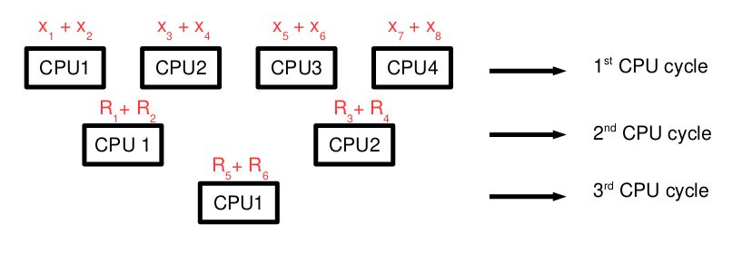
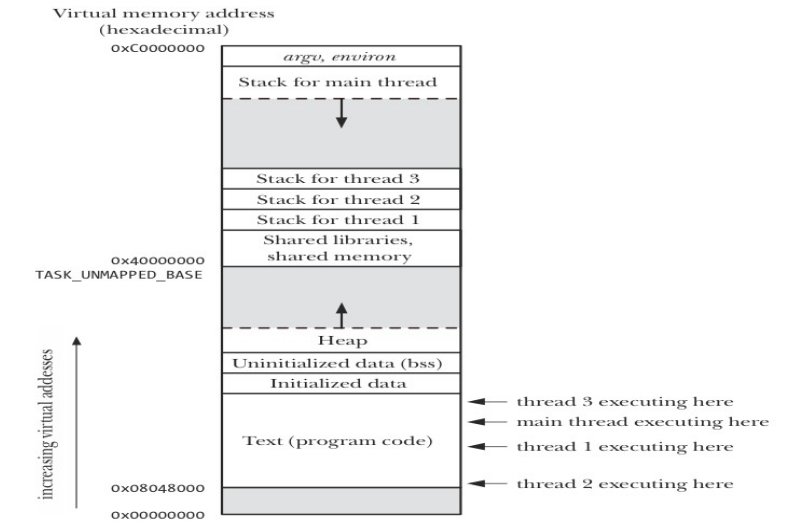
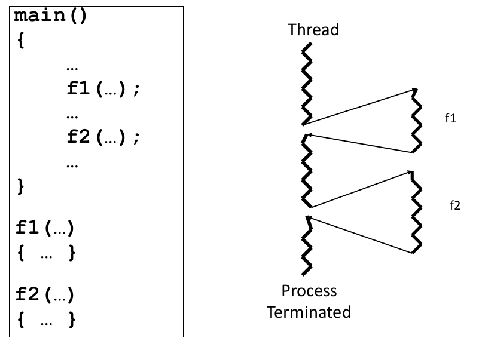
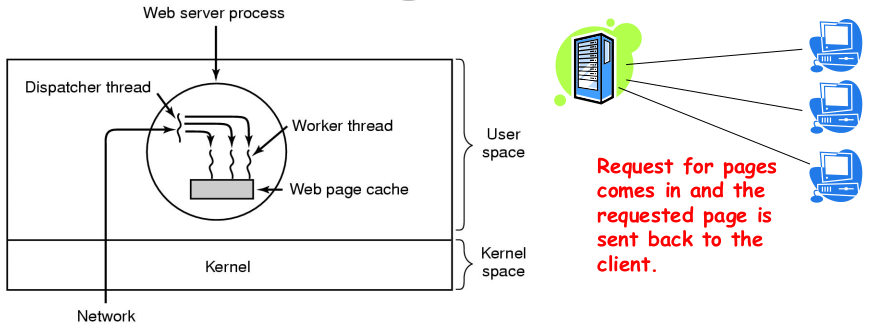
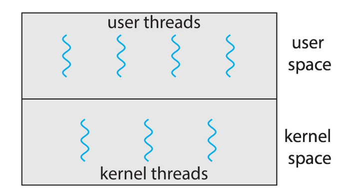
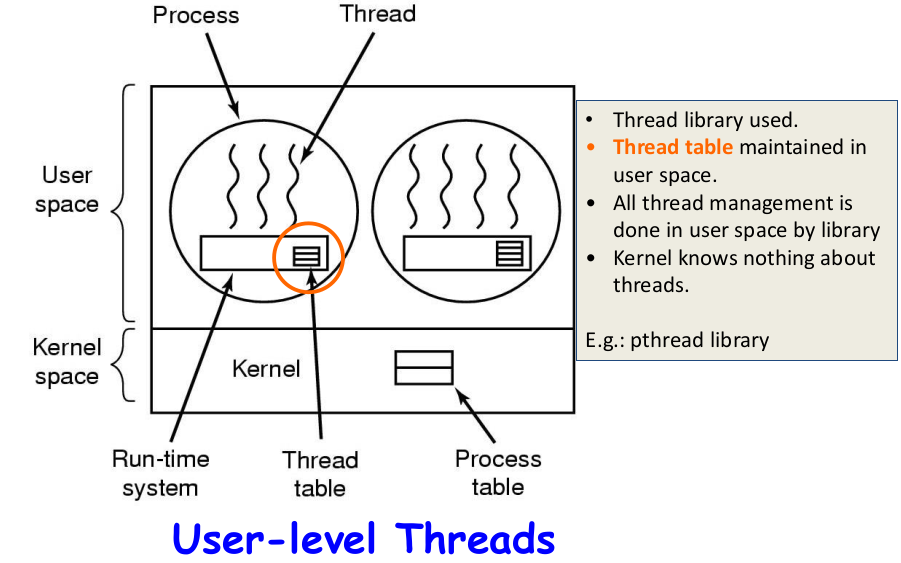
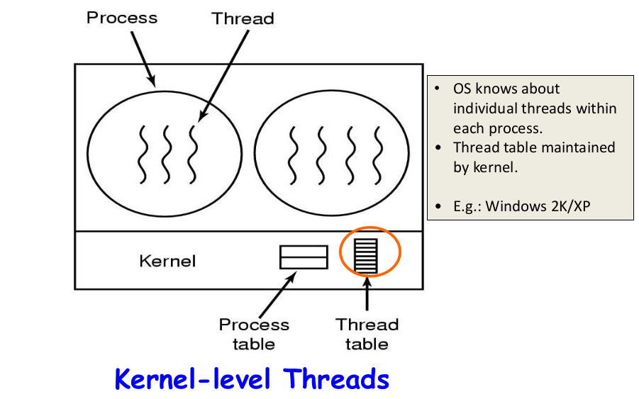

# Thread Managment

Threads are the smallest unit of execution within a process and are responsible for executing a sequence of instructions.

## Types of Threads

- `User-level threads` (ULTs): Managed entirely by user-level libraries and are invisible to the kernel. ULTs are `lightweight` but may not take full advantage of multiple CPU cores.
- `Kernel-level threads` (KLTs): Managed and scheduled by the operating system's kernel. KLTs can take full advantage of multiple CPU cores but may have more overhead.

## Overview of Threads

#### Sequentional Programming

---

Suppose we want to add eight numbers `x1, x2, x3, .... x8`
There are seven addition operations and if each
operation take 1 CPU cycle, the entire operation will
take seven cycles.

```C
x1 + x2 + x3 + x4 + x5 + x6 + x7 + x8
```

#### Concurrent / Parallel Programming

---

Suppose we have `4xCPUs` or a `4xCore` CPU, the seven addition
operations can now be completed in just three CPU cycles, by
dividing the task among different CPUs.



## Ways to Achieve Concurrency

#### Multiple single threaded processes

- Use **fork**() to create a new process for handling every new
task, the **child** process **serves** the client process, while the parent
listens to the **new request**.
- Possible only if each **slave** can operate in **isolation**
- Need IPC between processes
- *Lot of memory and time required for process creation.*

#### Multiple threads within a single process

- Create `multiple` threads within a **single** process.
- Good if each `slave` need to share data.
- Cost of creating threads is low, and no IPC required.

#### Single process multiple events

- Use non-blocking or asynchronous I/O, using **select**() and
**poll**()system calls.

### Processes and Threads (cont...)

---

#### Similarities between Processes & Threads

- Like a process, a thread can also be in one of many **states**
**(new, ready, running, block, terminated)**
- Only one thread can be in `running` state (single **CPU**)
- Like a process a thread can create a **child** **thread**.

#### Differences between Processes & Threads

- No automatic **protection** in threads
- Every process has its **own** address space, while all other
threads within a process executes within the `same address space`.

#### Every process has two characteristics

- `Resource ownership` **=>** process includes a virtual address
space to hold the process image
- `Scheduling` **=>** follows an execution path that may be
`interleaved` with other processes.

These two characteristics are treated independently by the
operating system. The unit of resource ownership is referred to
as a process, while the unit of `dispatching` is referred to as a
thread.

### Single vs Multiple Threaded Process

---


### Multi-Threaded Process

---

| Threads within a process share | Threads have their own |
|:------------------------------|:----------------------|
|PID, PPID, PGID, SID, UID, GID  | Thread ID |
|Code and Data Section           | CPU Context (PC, and other registers)|
|Global Variables                |Stack|
|Open files via **PPFDT**        |State|
|Signal Handlers                 |The errno variable|
|Interval Timers                 |Priority|
|CPU time consumed               |CPU affinity |
|Resources Consumed              |Signal mask |
|Nice value                      | |
|Record locks (created using **fcntl**())|

---



### Threads vs Processes

---

`Similarities`

- A thread can also be in one of many states like new,
ready, running, blocked, terminated.
- Like processes only one thread is in running state
(single CPU).
- Like processes a thread can create a child thread.

`Differences`

- No `automatic` protection mechanism is in place for
threads—they are meant to help each other.
- Every process has its own address space, while all
threads within a process operate within the same
address space.



### Benefits of Threads

---

- `Responsiveness`. Multi-threaded servers (e.g., browsers)
can allow interaction with user while a thread is formulating
response to a previous user query (e.g., rendering a web page).
- `Resource sharing`. Process resources (code, data, etc.)
are shared by all threads. OS resources (PCB, PPFDT, etc.) are
also shared by all threads.
- `Economy`. Take less time to create, schedule, and
terminate a thread. Solaris 2: Thread Creation is thirty times
faster than Process Creation and Thread Switching is five
times faster than process switching.
- `Performance`. In multi-processor and multi-threaded
architectures (e.g., Intel’s P-IV HT) each thread may run on a
different processor in parallel.

### Disadvantages of Threads

---

- `Problems due to Shared memory`
  - Race Problem.
  - Mutual Exclusion needs to be implemented on shared
memory to allow multiple threads to access data for
write/update.
- Many library functions are not `Thread Safe`
  - For resource sharing, synchronization is needed
between threads
- `Lack of Robustness`
  - A severe error caused by one thread (e.g. segmentation
fault) terminates the whole process.

### Thread Usage: Web Server

---



- `Dispatcher` thread reads incoming requests from the NW.
- After examining the request, it chooses an idle worker thread and hands it the
request. It also wakes up the worker from blocked state to ready state.
- Worker now checks to see if the request can be `satisfied` from the Web page
cache, to which all threads have access. If not, it starts a **read**() operation to
get the page from the disk and blocks until the disk operation completes. When
the thread blocks on the disk operation, another thread is chosen to run,
possibly the dispatcher, in order to acquire more work, or possibly another
worker that is now ready to run.

## User Threads vs Kernel Threads

### User Threads

---

Thread management is done by user-level threads libraries **(eg, POSIX Pthread, Win32 threads, Java threads, Solaris2 Threads, Mach C Threads)** and Kernel is not aware of the existence of threads.

- An application can be programmed to be multithreaded
by using user level thread library, which contains code
for
  - Thread creation and termination
  - Thread scheduling
  - Saving and restoring thread context
  - Passing messages and data between threads

By default an application begins with a single thread,
within a process managed by Kernel. Later the
application may spawn a new thread within the same
process by invoking spawn **utility** in the thread library.

#### User Threads vs Kernel Threads



### Kernel Threads

---

`Kernel Threads`

- Thread management done by kernel and
Kernel is aware of threads.
- Kernel level threads are supported in almost
all modern operating systems.
  - Windows NT/XP/2000
  - Linux
  - Solaris
  - Tru64 UNIX
  - Mac OS X
There must be a relationship between user threads
and kernel threads. There exist three common
models of this interaction (1:1, M:1 and M:N).

### Thread Libraries

---

- `Thread` libraries provides programmers with API for
creating and managing threads.
  - Two primary ways of implementing
  - Library entirely in user space
  - Kernel-level library supported by OS
  - Pthreads may be provided either as user-level or kernel-
level.
- `Pthread` is a POSIX standard (IEEE 1003.1c) API for
thread creation and synchronization
- `Java Threads` managed by the JVM. Typically implemented using the threads model provided by
underlying OS. Java threads may be created by: Extending
Thread class, or by implementing the Runnable interface.
If underlying OS is Windows, then implemented using
Win32 API; if it is Linux, then **Pthreads**.

#### Implementing Threads in User Space

---



#### Implementing Threads ihn kernel Space

---



### Additional Links

---

- [Overview of OS](https://github.com/meharehsaan/operating-system/tree/master/overview)
- [Intro to Linux](https://github.com/meharehsaan/operating-system/tree/master/introduction-to-linux)
- [Basic Shell Commands](https://github.com/meharehsaan/operating-system/tree/master/basic-shell-commands)
- [Program-vs-Process](https://github.com/meharehsaan/operating-system/tree/master/program-vs-process)
- [Program Management](https://github.com/meharehsaan/operating-system/tree/master/process-managment)
- [System Calls](https://github.com/meharehsaan/system-programming/tree/master/system-calls)
- [C program compilation](https://github.com/meharehsaan/system-programming/tree/master/c-compilation)
- [Linking C program](https://github.com/meharehsaan/system-programming/tree/master/linking)
- [File System Architecture](https://github.com/meharehsaan/system-programming/tree/master/filesystem-architecture)
- [Pipe's & Fifo's](https://github.com/meharehsaan/system-programming/tree/master/pipes)
- [IPC-Signals](https://github.com/meharehsaan/system-programming/tree/master/IPC-Signals)

<br>

---

Best Regards - [Mehar Ehsaan](github.com/meharehsaan)
